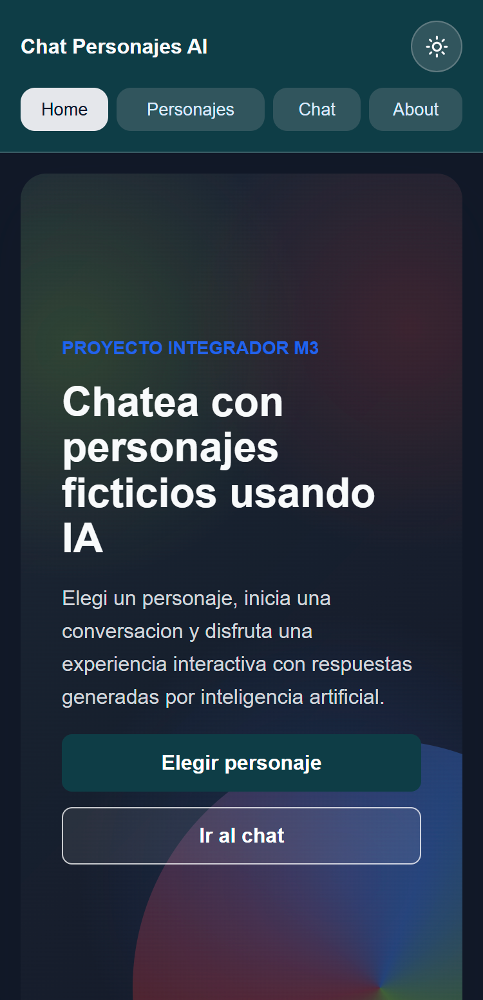
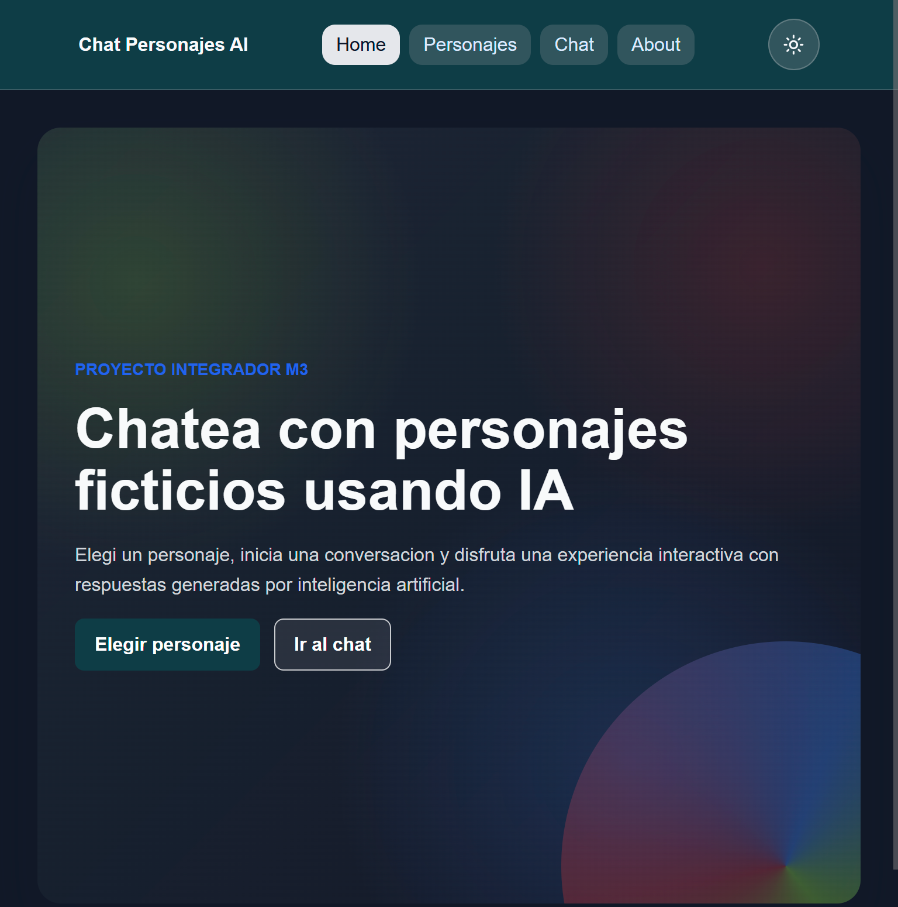
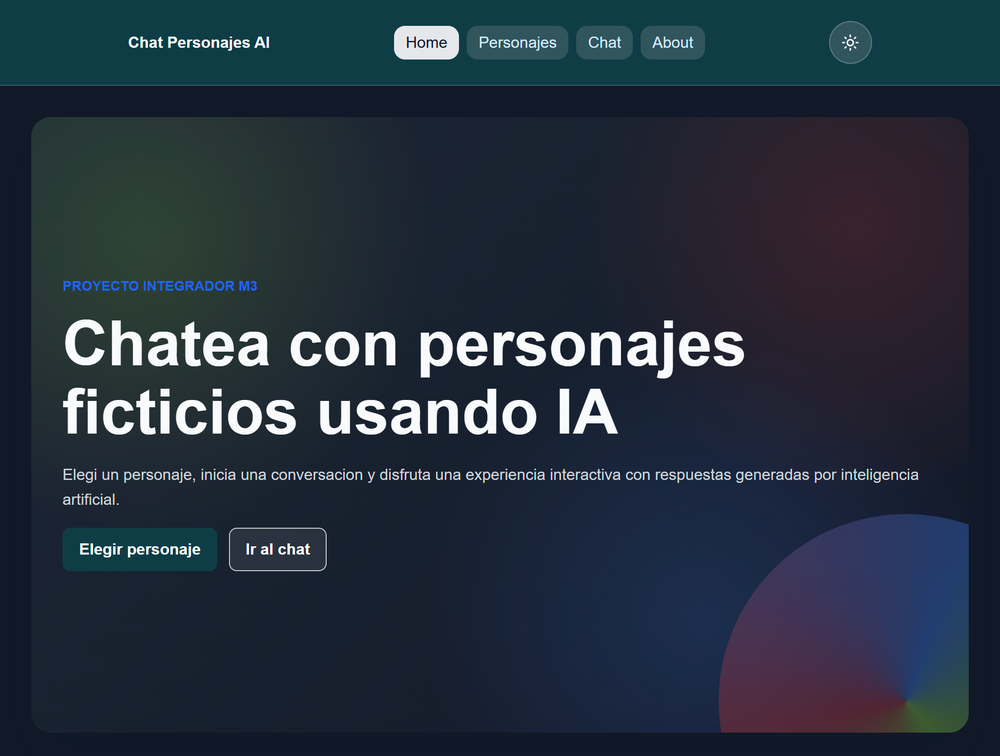

# Chat Personajes AI

SPA responsive desarrollada como Proyecto Integrador del modulo M3. La aplicacion permite elegir un personaje ficticio y conversar con el mediante respuestas generadas por inteligencia artificial usando Gemini API y Vercel Functions.

## Deploy

Link del proyecto desplegado:

https://chat-personajes-ai-jazmin-morinigo.vercel.app/

## Repositorio

https://github.com/noejazmin/ChatPersonajesAI_JazminMorinigo

## Descripcion

Chat Personajes AI es una aplicacion web de una sola pagina donde el usuario puede seleccionar entre distintos personajes ficticios y mantener una conversacion interactiva con cada uno.

Cada personaje tiene una personalidad, un tono de respuesta, una presentacion inicial y un estilo visual propio. El proyecto trabaja con rutas internas, estado global, persistencia en localStorage, consumo de API mediante una funcion serverless y tests unitarios.

## Personajes disponibles

- Shrek: directo, sarcastico, algo grunon y con humor seco.
- Tyrion Lannister: culto, ingenioso, sarcastico y orientado a explicar historia economica mundial.
- Tommy Shelby: estrategico, intenso, elegante y conversacional, con humor seco y tono dramatico.

## Funcionalidades principales

- SPA con navegacion interna.
- Rutas para Home, Personajes, Chat, About y pagina 404.
- Seleccion de personaje activo.
- Chat con mensajes diferenciados entre usuario y personaje.
- Saludo inicial por personaje.
- Respuestas generadas con Gemini API.
- Funcion serverless en Vercel para proteger la API key.
- Persistencia de historial por personaje en localStorage.
- Eliminacion de historial.
- Copiado de mensajes.
- Modo claro y oscuro.
- Diseno responsive para mobile, tablet y desktop.
- Validacion de mensajes vacios y mensajes largos.
- Transformacion y limpieza del historial antes de enviarlo a Gemini.
- Tests unitarios con Vitest.

## Extras agregados

Ademas de los requisitos principales del proyecto, se agregaron funcionalidades extra para mejorar la experiencia de usuario y reforzar los contenidos vistos en clase:

- Multiples personajes: la app permite conversar con tres personajes distintos, cada uno con personalidad, tono y estilo visual propio.
- Galeria de personajes: se agrego una vista para elegir el personaje activo antes de iniciar el chat.
- Persistencia por personaje: cada personaje conserva su propio historial usando localStorage.
- Modo claro y oscuro: el usuario puede alternar el tema visual de la aplicacion.
- Mensajes copiables: los mensajes del usuario y del personaje tienen boton para copiar contenido.
- Validaciones de entrada: se controla que el usuario no envie mensajes vacios ni mensajes demasiado largos.
- Transformadores de historial: antes de enviar informacion a Gemini, el historial se limpia, se filtra y se transforma al formato esperado por la API.
- Control del saludo inicial: el saludo del personaje se muestra en pantalla, pero no se envia como primer mensaje a Gemini.
- Manejo de errores: se contemplan errores de API, limite temporal de Gemini y respuestas fallidas.
- Funcion serverless: la API key no se expone en el frontend, sino que se usa desde una Vercel Function.
- Tests unitarios: se agregaron pruebas para personajes, historial, normalizacion, validacion, payload y servicio de chat.

## Capturas responsive

### Mobile



### Tablet



### Desktop



## Tecnologias utilizadas

- HTML
- CSS
- JavaScript modular
- History API
- localStorage
- Fetch API
- Gemini API
- Vercel Functions
- Vitest
- Git y GitHub
- Vercel

## Estructura del proyecto

```txt
project-root/
├── api/
│   └── chat.js
├── assets/
│   └── characters/
├── docs/
│   └── screenshots/
│       ├── mobile.png
│       ├── tablet.png
│       └── desktop.png
├── src/
│   ├── controllers/
│   ├── engine/
│   ├── services/
│   ├── state/
│   ├── storage/
│   ├── ui/
│   ├── views/
│   ├── main.js
│   ├── navigation.js
│   └── router.js
├── tests/
├── .env.example
├── .gitignore
├── index.html
├── package.json
├── styles.css
├── vercel.json
└── README.md
```

## Instalacion

Clonar el repositorio:

```bash
git clone https://github.com/noejazmin/ChatPersonajesAI_JazminMorinigo.git
```

Entrar a la carpeta del proyecto:

```bash
cd chat-personajes-ai
```

Instalar dependencias:

```bash
npm install
```

## Variables de entorno

Crear un archivo `.env` en la raiz del proyecto con la siguiente variable:

```env
GEMINI_API_KEY=tu_api_key_de_gemini
```

El archivo `.env` no se sube al repositorio porque contiene informacion sensible.

El proyecto incluye `.env.example` como referencia:

```env
GEMINI_API_KEY=
```

## Ejecutar en local

Para levantar el proyecto con Vercel Dev:

```bash
npm run local
```

Luego abrir la URL que indique la terminal, por ejemplo:

```txt
http://localhost:3000
```

## Ejecutar tests

Para ejecutar los tests unitarios:

```bash
npm test
```

Tests incluidos:

- tests de personajes;
- tests de historial;
- tests de normalizacion de respuestas;
- tests de validacion de mensajes;
- tests de payload para Gemini;
- tests del servicio de chat usando fetch mockeado.

## Uso de Gemini API

La conexion con Gemini no se realiza directamente desde el frontend.

El frontend envia los mensajes a una Vercel Function ubicada en:

```txt
/api/chat
```

Esa funcion toma la API key desde las variables de entorno, arma la solicitud hacia Gemini y devuelve una respuesta limpia al frontend.

Esto evita exponer la API key en el navegador y mantiene la conexion con Gemini del lado del servidor.

## Validaciones y transformadores

El proyecto incluye funciones para validar y preparar los datos antes de enviarlos a Gemini.

Validaciones aplicadas:

- validacion de mensajes vacios;
- validacion de mensajes formados solo por espacios;
- limite maximo de caracteres;
- control de mensajes invalidos antes de enviarlos al chat.

Transformadores aplicados:

- limpieza de mensajes invalidos;
- filtrado de roles permitidos;
- recorte del historial para evitar enviar demasiada informacion;
- transformacion del historial al formato esperado por Gemini;
- control para evitar que el saludo inicial del personaje se envie como primer mensaje del modelo.

Estas funciones ayudan a que el flujo del chat sea mas estable, previsible y facil de testear.

## Registro del uso de IA en el proyecto

Durante el desarrollo del proyecto se utilizo asistencia de IA como apoyo para:

- organizar el plan de trabajo del proyecto integrador;
- revisar la estructura sugerida por la consigna;
- pensar la arquitectura modular del proyecto;
- definir responsabilidades entre archivos;
- crear y mejorar funciones de validacion;
- analizar errores de Vercel, Gemini y rutas SPA;
- mejorar prompts y personalidades de los personajes;
- reforzar conceptos de localStorage, History API, serverless functions, tests y fetch;
- redactar documentacion tecnica.

La IA fue utilizada como herramienta de guia, explicacion paso a paso y revision.

## Aprendizajes aplicados

En este proyecto se aplicaron contenidos vistos en el modulo M3:

- JavaScript modular;
- manipulacion del DOM;
- eventos;
- rutas internas con History API;
- manejo de estado;
- persistencia con localStorage;
- consumo de servicios con fetch;
- uso de variables de entorno;
- funciones serverless;
- validaciones;
- transformadores de datos;
- tests unitarios;
- despliegue en Vercel;
- control de versiones con Git y GitHub.

## Estado del proyecto

Proyecto funcional y desplegado en Vercel.